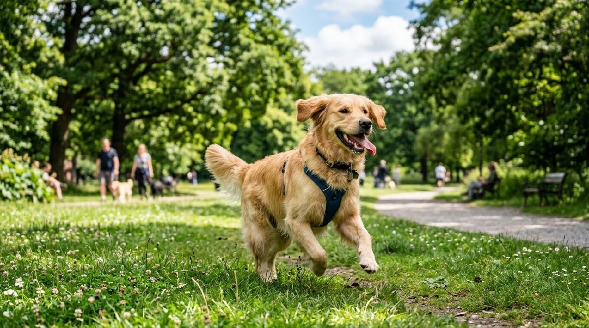
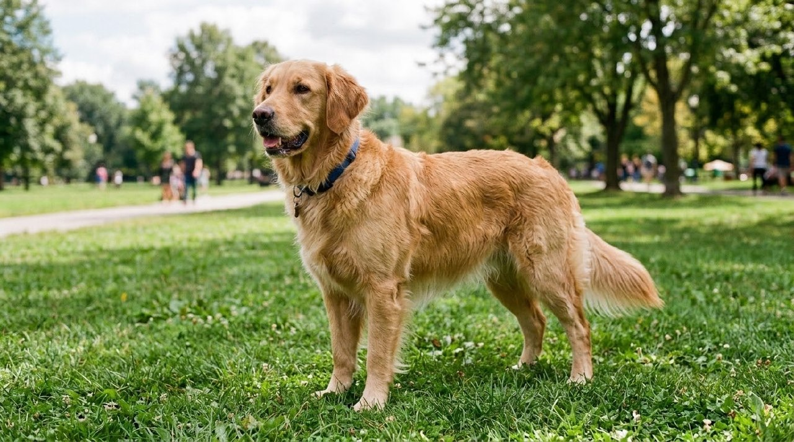
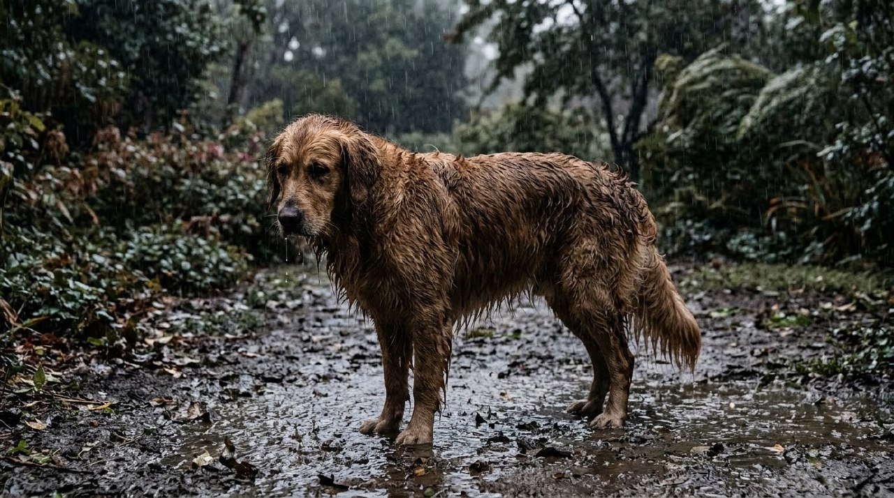
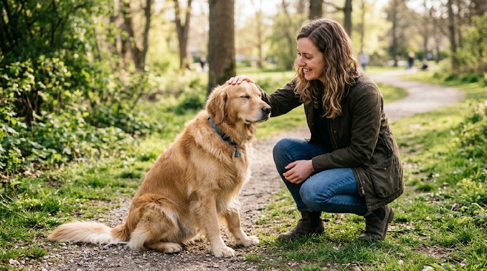
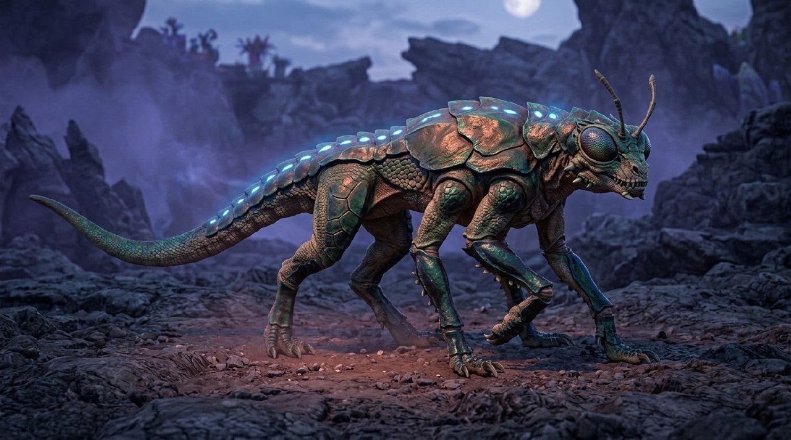

# Example — Animal & Creature Behavior Lookbook

## Purpose

Worked example of `knowledge/animal-creature-behavior-bible.md`: identity/scale lock, observable behavior selection, weather interaction, contact performance, and invented-creature internal consistency. Five tests, same recurring dog (a golden retriever) for tests 2–4 so identity stays constant while the bible's other axes vary, plus one fully invented creature testing the bible's §Invented creatures rule.

---

## 1. Generic/vague direction (no checklist applied)

**Prompt:** "A happy dog in a park."

QA: legible and pleasant, but nothing about identity, gait, or observable behavior was actually directed — the model chose an uncontrolled mid-stride running pose on its own. Included as the baseline "what happens without the checklist," not a failure.

## 2. Full checklist applied (§Identity and scale + §Observable behavior)

**Prompt:** "A medium-sized golden retriever, floppy ears, brown eyes, tan-gold fur, standing on grass in a park. Ears relaxed and slightly forward, gaze directed off to the side, tail held low and softly swaying, weight evenly distributed on all four paws in a natural stance, mouth slightly open in a relaxed pant. Believable canine biomechanics, natural fur texture."

QA: a deliberate, controlled standing pose with weight visibly settled on all four paws, ears and gaze matching the specified direction — a directed performance rather than the model's default choice, confirming the identity+behavior checklist changes the outcome versus #1. **Pass.**

## 3. Weather interaction (§Weather interaction)

**Prompt:** "The same golden retriever standing outside in heavy rain. Fur visibly wet and clumped/darkened especially along the back and ears, water dripping off the muzzle and tail, rain visibly hitting the ground creating splashes and mud around its paws, nearby foliage bent slightly from rain and wind. Ears back, head lowered slightly, believable weather interaction consistent between the dog and environment."

QA: fur clumping/darkening is visible along the back and legs, muzzle has visible drip, ground is wet with puddles/mud — the dog and environment read as inhabiting the *same* weather (per the bible's rule), not a dry dog composited into a rainy plate. Ears back and head lowered as specified. **Pass.**

## 4. Contact behavior (§Contact)

**Prompt:** "A woman crouching down to gently pet the same golden retriever's head, her hand making contact at the top of the dog's head between the ears. The dog's eyes are half-closed, head slightly leaning into her hand, tail relaxed, weight settled and calm. Clear contact point, believable pressure and weight, no hand sinking unnaturally into fur."

QA: contact point is unambiguous (hand on top of the head between the ears), and the dog's closed eyes and head leaning into the hand sell believable weight/pressure without the hand visibly sinking into or clipping through the fur. **Pass.**

## 5. Invented creature (§Invented creatures)

**Prompt:** "A fictional quadruped creature, part reptile part insect, with iridescent chitinous armor plates over reptilian scaled limbs, six segmented legs, glowing bioluminescent markings along its spine, large compound insect eyes, standing on rocky alien terrain. Internally consistent anatomy: six legs following a plausible insect-like gait stance, scaled skin texture consistent across the body, glowing markings casting soft light on the ground beneath it. No mixed inconsistent anatomy, no extra or missing limbs, no anatomically impossible joints."

QA: confirmed six legs in a plausible insect-like stance (not the default four), scaled/armored skin texture held consistent across the whole body rather than switching material partway, and the bioluminescent spine markings visibly cast light onto the ground beneath the creature as specified. Per §Invented creatures, the standard here isn't "is this a real animal" but "are its own locked rules followed consistently" — they were. **Pass.**

---

## Takeaway

Locking identity, then directing observable behavior, weather interaction, and contact separately (rather than leaving any of them to the model's default) produced a controlled, directed result in every case — most visibly in #1 vs. #2, where the same species and setting produced an undirected default pose versus a deliberately specified one. For the invented creature (#5), "locked internal rules replace Earth-species norms" held up: six legs, one consistent material language, and light-casting markings were all honored together rather than the model reverting to a generic four-legged reptile.
