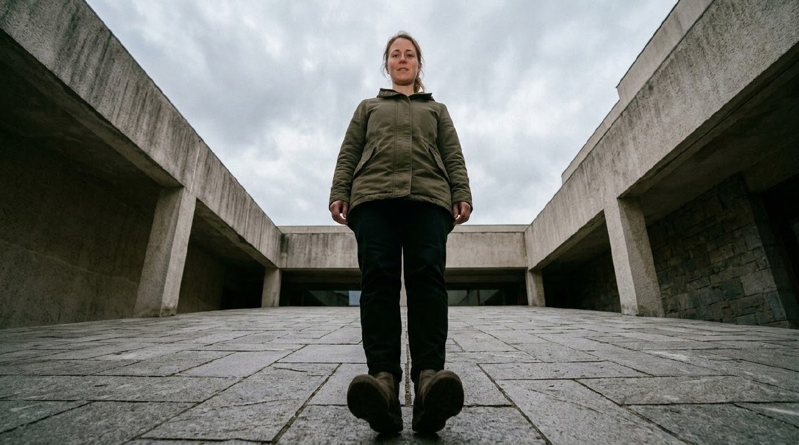
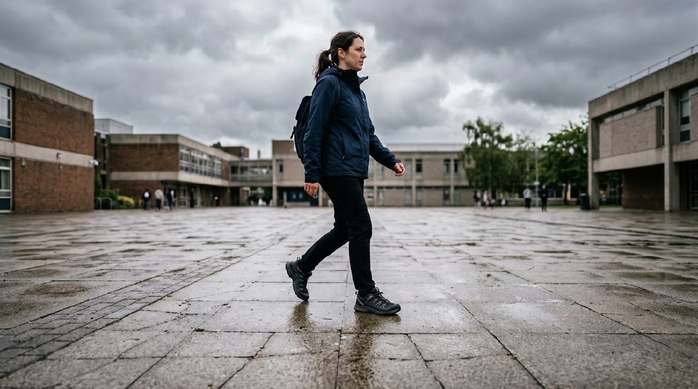
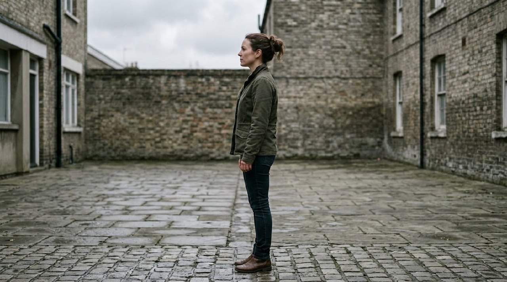
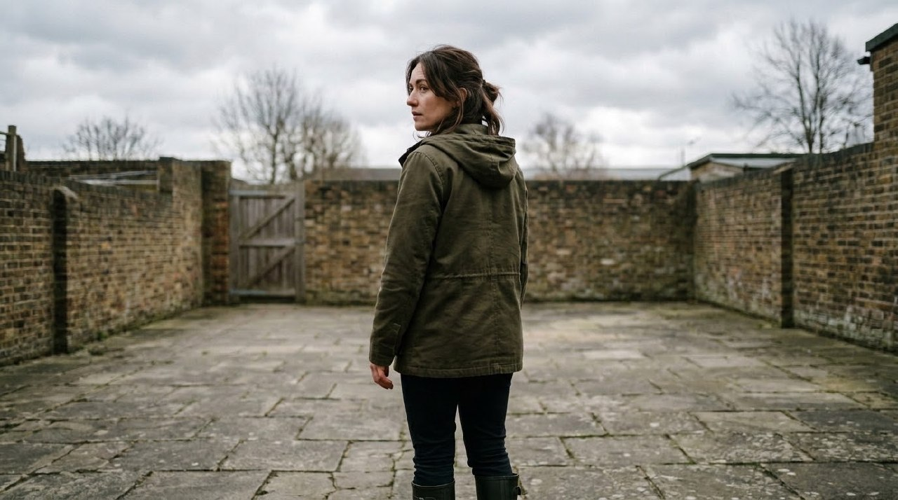
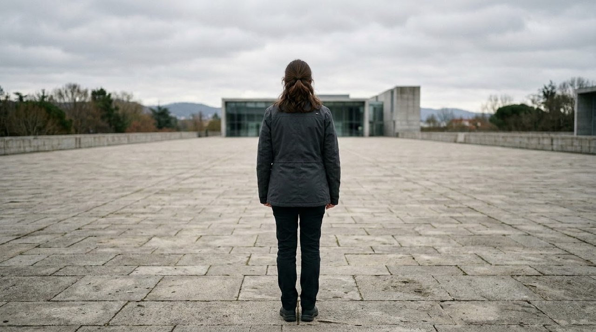
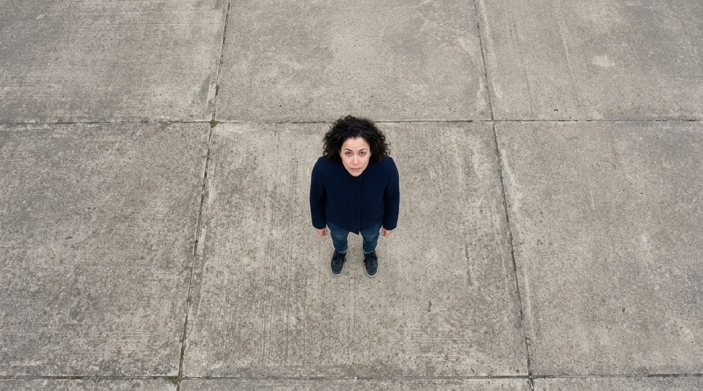

# Example — Camera Bible Height × Horizontal Position Lookbook

## Purpose

Worked example of `knowledge/camera-bible.md` §Camera height, §Horizontal relationship, and §"Horizontal position is not optional" — distinct from [`camera-registry-lookbook.md`](camera-registry-lookbook.md), which tests *what image system* a shot should behave like. This one tests *where the camera physically is*: the bible's warning is that a shot description giving only size + subject, without an explicit horizontal-relationship value, "routinely resolves into a physically impossible camera placement."

Six height × horizontal-position combinations were rendered on the same subject and location (a plain paved courtyard, overcast sky) so the environment stays constant and only the camera variable changes. Every prompt states both axes explicitly, per the rule.

**Result: 6/6 renders show a physically coherent, distinct camera placement.** No occurrence of the specific failure the guard warns about (e.g. a "rear view" that impossibly still shows the face, or a floating camera position that couldn't exist relative to the ground/subject).

---

## 1. Floor height + frontal (0°)

**Prompt:** "Extreme low-angle shot, camera positioned at floor level looking directly up. Frontal 0-degree view of a woman ... standing in a plain paved courtyard under an overcast sky, looking down toward camera. Camera height: floor level. Horizontal position: frontal, facing camera directly."

QA: the extreme upward perspective, foreshortened body, and steep converging architecture lines are all consistent with a genuine floor-level camera looking up — not a normal-height shot merely tilted. **Pass.**

## 2. Knee height + three-quarter (~35°)

**Prompt:** "Low-angle shot from knee height, three-quarter horizontal view (about 35 degrees) of the same woman walking across the courtyard. Camera height: knee level. Horizontal position: three-quarter angle."

QA: moderate low angle (less extreme than #1) with a clear three-quarter body angle mid-stride — height and angle both read as distinct from #1's floor/frontal combination. **Pass.**

## 3. Eye height + profile (90°)

**Prompt:** "Eye-level shot, full profile view (90 degrees) of the same woman standing in the courtyard, looking off to the side. Camera height: eye-level, matching her head height. Horizontal position: full profile."

QA: camera height sits level with her eyeline (neither looking up nor down), and the body is a clean full profile — this is the exact combination the bible flags as failure-prone when horizontal position is left unstated, and it resolved correctly here because it was stated. **Pass.**

## 4. Chest height + rear three-quarter (~135°)

**Prompt:** "Shot from chest height, rear three-quarter view (about 135 degrees) of the same woman, showing her back and the side of her face as she looks back over her shoulder, standing in the courtyard. Camera height: chest level. Horizontal position: rear three-quarter."

QA: back and shoulder dominate the frame with only a sliver of her face visible via the over-the-shoulder glance — correct rear-three-quarter geometry, not a disguised front view. **Pass.**

## 5. Shoulder height + back (180°)

**Prompt:** "Shot from shoulder height, directly behind the same woman (180 degrees, full back view) as she looks forward across the courtyard, away from camera. Camera height: shoulder level. Horizontal position: full back view, only the back of her head and body visible."

QA: pure back view, zero face visibility — this is the combination most at risk of the guard's named failure (a "back" shot that impossibly shows the face because horizontal position wasn't pinned down); it did not happen here. **Pass.**

## 6. Aerial + frontal (top-down)

**Prompt:** "Aerial drone shot directly overhead, looking straight down at the same woman standing in the courtyard. Frontal top-down view so her face and the front of her body are visible looking up toward camera. Camera height: aerial, directly overhead. Horizontal position: frontal (top-down)."

QA: true bird's-eye perspective (foreshortened body radiating from the head, no horizon), face visible and turned up toward camera as instructed — the hardest height/angle combination to get physically right, resolved correctly. **Pass.**

---

## Takeaway

Height and horizontal position are independent axes, and every one of the six combinations produced a camera placement a real crew could actually achieve — confirming that stating both explicitly (per the bible's rule) is sufficient to avoid the "physically impossible camera placement" failure the guard exists to prevent, even at the extremes (floor/frontal, aerial/frontal, full back).
