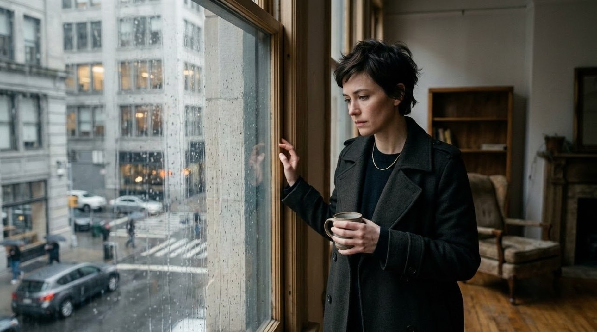
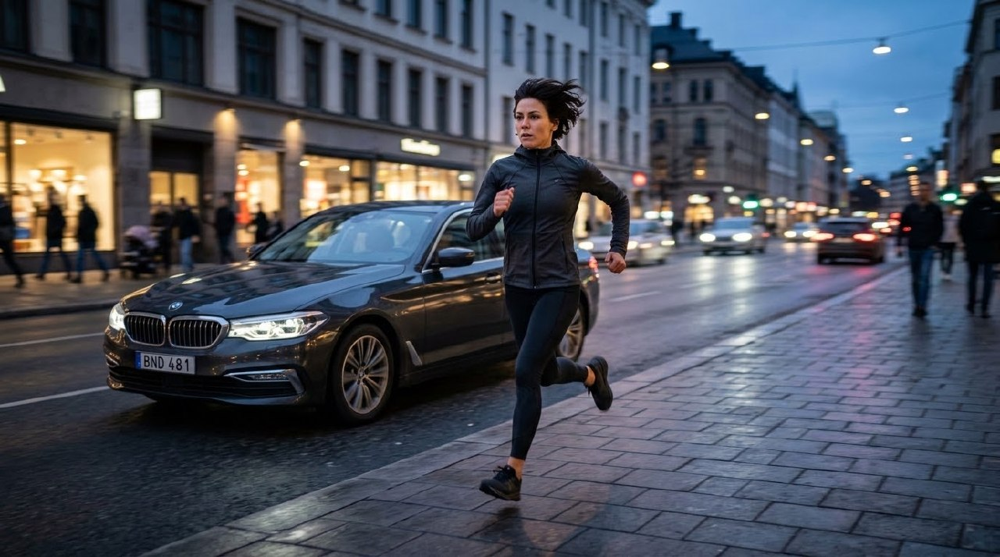
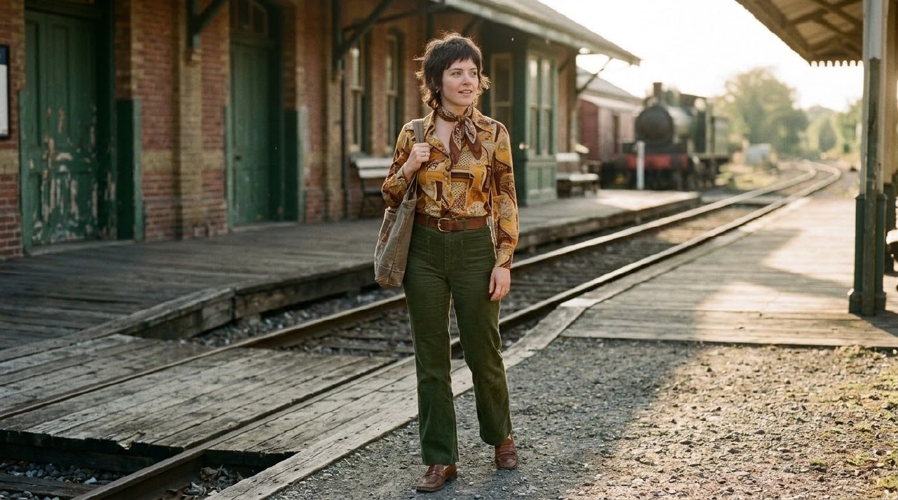
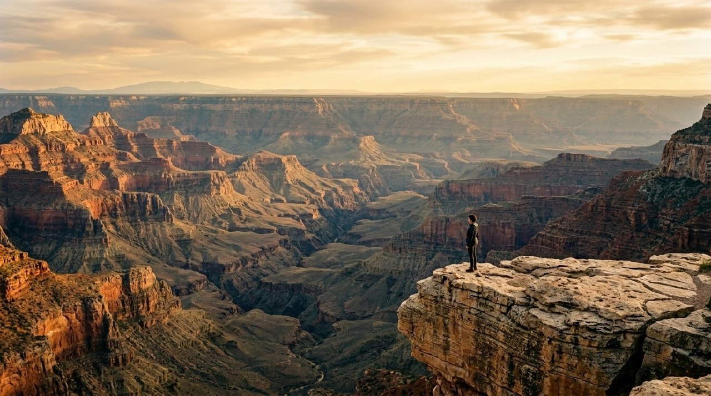

# Example — Camera Registry Guard Lookbook

## Purpose

Worked example of `libraries/camera-registry.yaml` used correctly per `knowledge/camera-selection-bible.md` §Critical guard: pick a registry entry for internal decision-making, then translate its `directorial_inference.character` list into non-branded adjectival prompt language — **never paste the `brand`/`model` field into the generation prompt as a literal noun.**

This matters because it is a confirmed production bug, not a theoretical caution: naming a real camera/lens/film model in a text-to-image/video prompt has caused models to render the camera itself as a physical object in frame, complete with a fabricated HUD, false on-screen readouts, or watermark-style overlays (see `knowledge/ai-video-failure-bible.md`).

Six registry entries spanning distinct categories were selected, each translated to a prompt with **zero brand/model names** and an explicit negative constraint (`no camera or recording equipment visible in frame, no HUD, no watermark`) as a direct test of the guard, then test-rendered once each. Same recurring actress across all six so the registry entry's character — not the subject — is the variable under test; each is paired with the scenario its own `best_for` field names, since that's how a creative director would actually apply the registry.

**Result: 0/6 renders showed a fake camera, HUD, or watermark artifact.** All six read as plausible photographs/film frames with no visible acquisition equipment.

---

## 1. ARRI ALEXA 35 (`ARRI_ALEXA_35`)

- Category / format: digital cinema, Super 35
- `directorial_inference.character`: filmic highlight behavior, natural skin, high latitude, classic S35 geometry
- `best_for`: narrative, commercial, HDR, action

**Prompt (no brand names):** "A woman in her early 30s, short dark hair, tailored coat, standing by a rain-streaked city window in soft daylight, narrative drama mood. Large-format digital-cinema rendering: filmic highlight rolloff, natural skin rendering, high dynamic-range latitude, classic wide-format lens geometry, organic micro-contrast. No camera or recording equipment visible in frame, no HUD, no on-screen readout, no watermark, no logos or text."

QA: soft window highlight rolloff and natural skin read consistent with the registry's stated character; no equipment artifact. **Pass.**

---

## 2. RED V-RAPTOR XL [X] (`RED_V_RAPTOR_XL_X`)

- Category / format: digital cinema, VistaVision, global shutter
- `directorial_inference.character`: high-detail modern cinema, strong action/VFX suitability, crisp motion geometry
- `best_for`: action, vehicles, VFX plates, commercial

**Prompt:** "The same woman ... wearing a fitted jacket, running alongside a moving car on a city street at dusk. High-detail modern cinema rendering, crisp motion geometry, strong dynamic range, clean action-ready sharpness, precise motion clarity. No camera or recording equipment visible in frame, no HUD, no on-screen readout, no watermark, no logos or text."

QA: sharp, clean motion-friendly rendering with no rolling-shutter-style artifacts implied; no equipment visible. **Pass.**

---

## 3. Phase One IQ4 150MP (`PHASE_ONE_IQ4_150`)

- Category / format: medium-format still, 53×40mm
- `directorial_inference.character`: extreme still detail, large-format tonal separation, high microtexture resolution
- `best_for`: beauty, fashion, product, architecture, landscape, hero portraits

**Prompt:** "The same woman's face ... in a hero beauty close-up against a plain seamless backdrop, soft directional studio light. Extreme still detail, large-format tonal separation, high microtexture skin resolution, natural pores and texture preserved, no plastic smoothing. No camera or recording equipment visible in frame, no HUD, no watermark, no logos or text."

QA: skin retains natural pore-level texture rather than plastic-smoothed AI skin (the exact anti-pattern §26 of `color-grading-bible.md` warns against); no equipment visible. **Pass.**

---

## 4. Leica M11-P (`LEICA_M11_P`)

- Category / format: rangefinder still, full-frame
- `directorial_inference.character`: documentary intimacy, rangefinder discipline, compact premium still language
- `best_for`: street, documentary stills, editorial, travel

**Prompt:** "The same woman ... walking through a crowded street market, candid unposed moment, natural available light. Documentary intimacy, compact premium still rendering, natural unforced color, rangefinder-style discipline in framing. No camera or recording equipment visible in frame, no HUD, no watermark, no logos or text."

QA: candid, unposed street-documentary feel with natural available light; no equipment visible. **Pass.**

---

## 5. Panavision Millennium XL2 (`PANAVISION_MILLENNIUM_XL2`)

- Category / format: 35mm film camera
- `directorial_inference.character`: photochemical cinema, classic Panavision workflow, organic temporal texture
- `best_for`: feature film, period, music video, commercial

**Prompt:** "The same woman ... in 1970s-style clothing standing on an old train platform, natural afternoon light. Photochemical cinema rendering, organic temporal film texture, classic organic grain, warm tonal character, gentle highlight rolloff. No camera or recording equipment visible in frame, no HUD, no watermark, no logos or text."

QA: warm organic film-like tonal character carried by wardrobe/location/light rather than a literal sepia filter (consistent with `color-grading-bible.md` §42 Period guidance); no equipment visible. **Pass.**

---

## 6. IMAX Keighley / next-gen IMAX film camera (`IMAX_KEIGHLEY_15_65`)

- Category / format: 65mm film, 15-perforation
- `directorial_inference.character`: maximum-scale photochemical capture, extreme negative area, event-cinema spectacle
- `best_for`: epic landscapes, large-scale action, premium theatrical sequences

**Prompt:** "The same woman ... standing as a small figure at the edge of a vast canyon landscape at golden hour. Maximum-scale photochemical capture, extreme negative-area detail, event-cinema spectacle scale, vast dynamic range across the landscape, epic sense of scale. No camera or recording equipment visible in frame, no HUD, no watermark, no logos or text."

QA: subject rendered small against vast, detailed landscape achieving the intended epic-scale spectacle; no equipment visible. **Pass.**

---

## Takeaway

The registry's `verified_specs` (facts) inform the internal decision of which real-world image system a shot should behave like; only the `directorial_inference.character` list — never `brand`/`model` — is safe to translate into the actual generation prompt. Across six structurally different categories (digital cinema large-format, action/VFX digital cinema, medium-format beauty still, rangefinder documentary, 35mm film period, 65mm film epic), zero renders exhibited the confirmed camera-as-object/HUD/watermark failure, confirming the guard's translation approach — not just its warning — actually holds up in practice.
