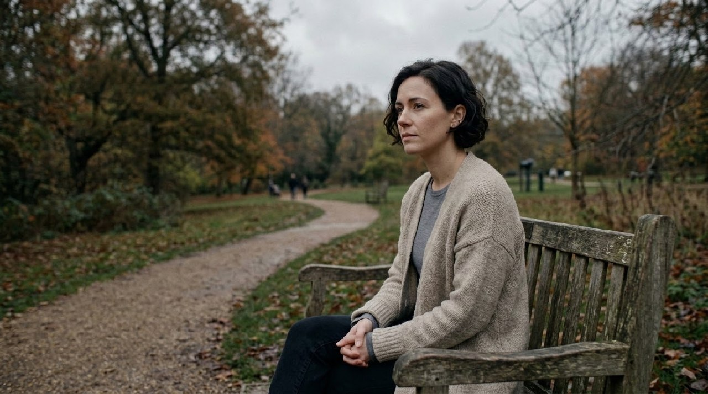
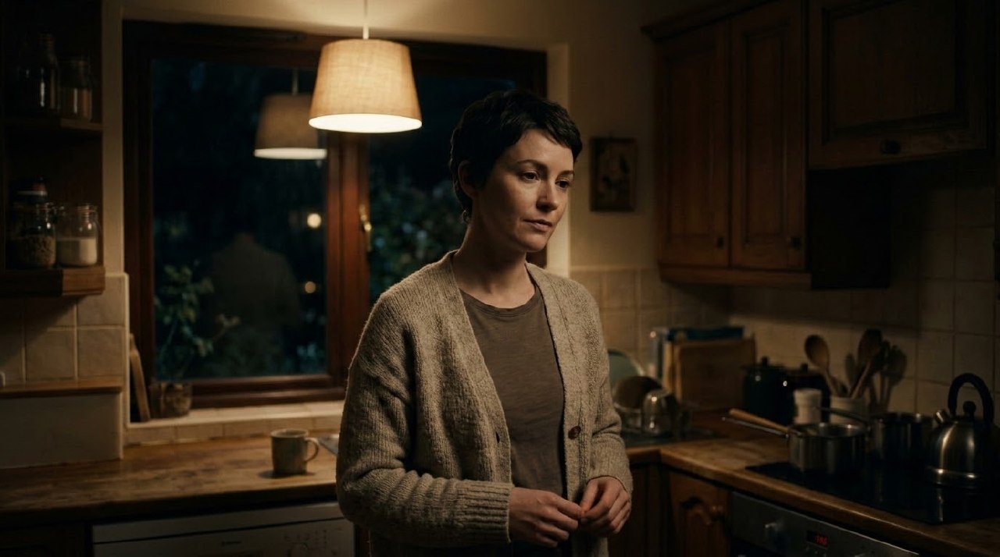
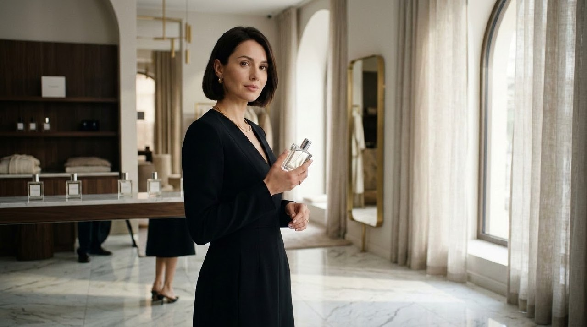
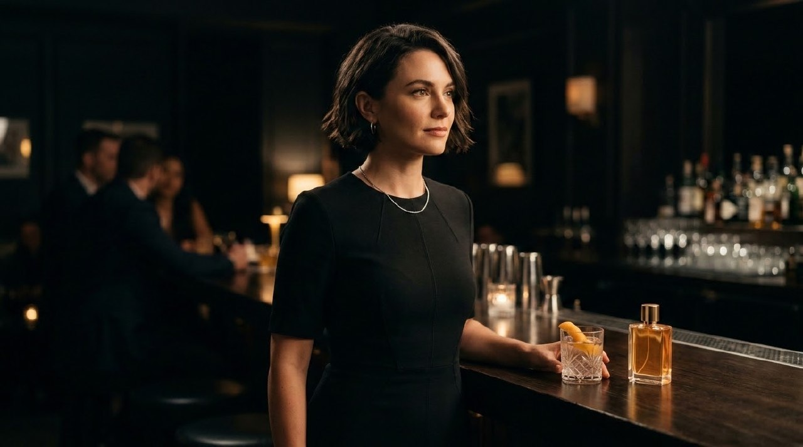
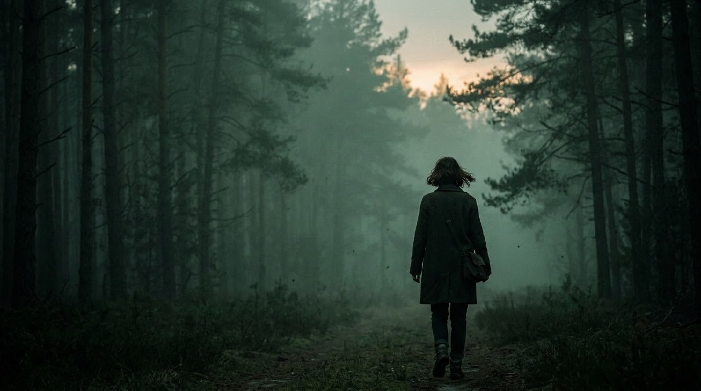
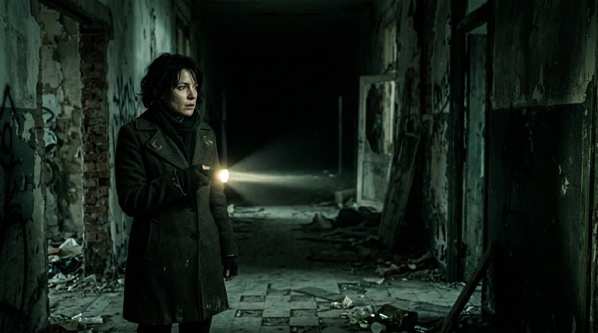
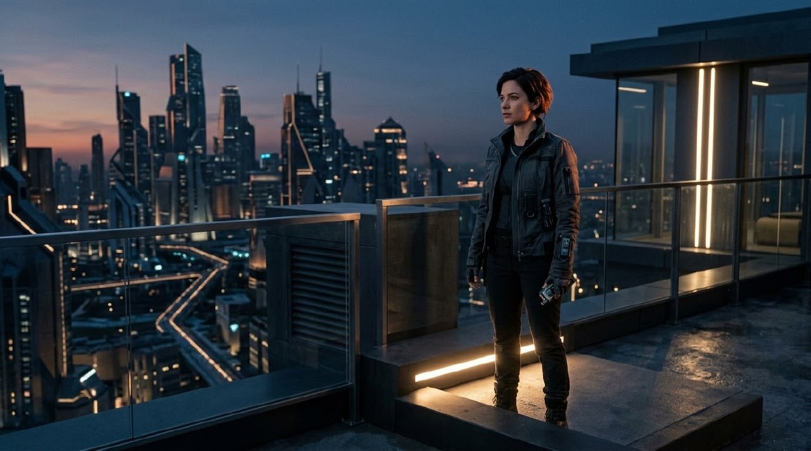
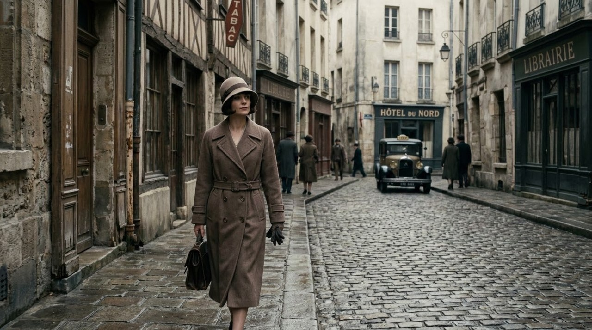
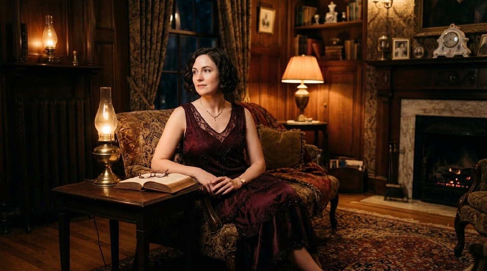

# Example — Color Grading Genre Lookbook

## Purpose

Worked example of `knowledge/color-grading-bible.md` §42 (*Genre heuristics*) and §47 (*Approval frames*) applied together: for each of the six genre archetypes listed in §42, a filled `templates/color-grading-brief.md` plus two test-render prompts (one bright/exterior frame, one dark/interior or night frame) verifying the show look survives contrasting lighting, per the §20 rule that *"a look must survive: bright scene, dark scene, interior, exterior."*

Same recurring actress across all twelve frames so the grade — not the subject — is the variable under test. Each genre is its own vignette/lookbook entry, not a continuous sequence, so the canonical-identity locks in `knowledge/prevention-first-generation.md` (which govern multi-shot sequences within one project) don't apply here; wardrobe and location are deliberately re-cast per genre because production design is itself part of what each genre heuristic specifies (see §44, color grading cannot rescue uncontrolled production design — the design has to already point the same direction as the grade).

All twelve frames below were test-rendered once each and reviewed against their brief per §50 (*Final grading QA*); all passed.

---

## 1. Natural drama

**Reference:** §42 Natural drama — restrained saturation, believable skin, controlled contrast, motivated source color.

### Grading brief
- Contrast: gentle, controlled — no stylized crush or density
- Blacks: open, neutral
- Highlights: soft, motivated by ambient/practical only
- Saturation: restrained, global
- Skin: believable, unforced, no peach/orange normalization
- Shadow color: neutral to slightly cool
- Highlight color: neutral to slightly warm (practicals)
- Texture: clean, no added grain
- Halation / bloom: none

### Test frames
- **Bright/exterior:** "a woman in her early 30s, short dark hair, plain oatmeal cardigan, sitting on a park bench under an overcast sky at midday. Soft natural daylight, muted restrained saturation, believable natural skin tone, gentle controlled contrast, fully motivated ambient light, no stylization."

  

- **Dark/interior:** "the same woman ... standing in a quiet home kitchen at night. Single warm overhead pendant light, soft naturalistic shadow, restrained saturation, believable skin, fully motivated practical light only, gentle contrast."

  

QA: both frames read as the same restrained, motivated-light world; skin luminance/warmth track together day to night. **Pass.**

---

## 2. Luxury commercial

**Reference:** §42 Luxury commercial — clean blacks, controlled specular highlights, precise product color, selective saturation.

### Grading brief
- Contrast: clean, controlled
- Blacks: deep, clean (wardrobe reads true black, no crush noise)
- Highlights: controlled specular — glass, marble, jewelry
- Saturation: selective (product/accent only), rest restrained
- Skin: neutral-warm, unforced
- Shadow color: neutral, deep
- Highlight color: precise — gold/warm accent tied to the product
- Product / brand rules: the same glass bottle must read identical color/material in both frames
- Texture: clean, no grain

### Test frames
- **Bright/interior:** "a woman ... tailored black dress, standing in a sunlit marble-floored boutique interior with sheer curtains, holding a minimalist glass perfume bottle. Clean specular highlight on the glass bottle and marble floor, deep clean blacks in the dress, selective warm gold accent saturation, precise controlled product color, otherwise restrained palette."

  

- **Dark/night:** "the same woman ... standing in an elegant dim cocktail lounge at night, the same minimalist glass perfume bottle placed on the bar beside her. Soft warm key light, clean specular highlights on glassware and jewelry, deep rich controlled blacks, precise warm product color on the bottle, selective saturation, otherwise restrained."

  

QA: product color and material read consistently across both lighting conditions; blacks stay clean (not crushed/noisy) in both. **Pass.**

---

## 3. Horror

**Reference:** §42 Horror — controlled underexposure, strategic color contamination, negative space, selective highlight attention.

### Grading brief
- Contrast: hard, deep shadow separation
- Blacks: dense, controlled (not crushed to noise)
- Highlights: sparse, deliberate — one attention point only
- Saturation: desaturated with cold green/cyan contamination
- Skin: allowed to read cold/pale under the contamination — not corrected back to neutral
- Shadow color: cold green-cyan
- Highlight color: single practical source (flashlight / fading sky)
- Texture: negative space used compositionally, not filled

### Test frames
- **Dusk/exterior:** "a woman ... dark coat, walking alone into a foggy pine forest at dusk. Controlled underexposure, strategic cold desaturated green color contamination, large negative space around her small figure, single sliver of fading light on the horizon, selective highlight attention."

  

- **Dark/interior:** "the same woman ... standing in a decayed abandoned hallway at night holding a flashlight. The flashlight beam is the only highlight in frame, everything else in deep controlled shadow, sickly desaturated green-cyan color contamination, strong negative space behind her."

  

QA: the green-cyan contamination and single-highlight discipline hold in both frames; negative space is compositional in both, not empty framing. **Pass.**

---

## 4. Comedy

**Reference:** §42 Comedy — generally readable faces, visual clarity, palette may be more open or saturated.

### Grading brief
- Contrast: low-moderate, bright and clean
- Blacks: open (never crushed — faces stay readable)
- Highlights: soft, even, no dramatic falloff
- Saturation: open, cheerful, above-natural
- Skin: bright, healthy, fully readable
- Shadow color: neutral, minimal
- Texture: clean

### Test frames
- **Bright/exterior:** "a woman ... bright yellow top, laughing brightly on a colorful sunny street lined with pastel-colored shopfronts. High-key even lighting, open saturated cheerful palette, completely readable face and expression, bright clean contrast, no harsh shadows."

  

- **Bright/interior:** "the same woman ... laughing in a cheerful brightly lit kitchen full of colorful props and fruit. Even soft light, no harsh shadows, saturated cheerful open palette, completely readable face and expression, bright clean contrast."

  

QA: face stays fully readable and evenly lit in both frames — no incidental hard shadow crept in on the interior version. **Pass.**

---

## 5. Sci-fi

**Reference:** §42 Sci-fi — deliberate source-color logic, clean separation, controlled practical color, avoid generic cyan/orange by default.

### Grading brief
- Contrast: clean, controlled
- Blacks: deep, clean
- Highlights: deliberate practical accents only (not ambient glow)
- Saturation: restrained overall; one controlled accent color per frame
- Skin: neutral, unaffected by accent lighting
- Shadow color: neutral-cool
- Highlight color: a single deliberate accent (warm-white / warm), explicitly not the generic teal-orange default
- Texture: clean, no added grain

### Test frames
- **Exterior/dusk:** "a woman ... sleek grey technical jacket, standing on a minimalist futuristic rooftop overlooking a clean geometric skyline at dusk. Deliberate controlled practical lighting in a single warm-white accent color, avoiding generic teal-and-orange, clean tonal separation between subject and environment, controlled source-color logic."

  

- **Interior/night:** "the same woman ... standing inside a minimalist futuristic control room at night. Cool white ambient functional light with one deliberate warm accent color on a control panel, clean tonal color separation, no random neon, controlled deliberate source-color logic."

  

QA: both frames commit to one deliberate accent color rather than a default teal/orange split-tone; subject stays cleanly separated from environment in both. **Pass.**

---

## 6. Period (early 20th century)

**Reference:** §42 Period — palette tied to production design, lens/texture/print-reference logic, avoid arbitrary sepia.

### Grading brief
- Contrast: moderate, filmic rolloff
- Blacks: warm-neutral, not crushed
- Highlights: soft, gentle halation
- Saturation: naturalistic, desaturated toward the production-design palette (browns/ivory/dust) — not a sepia wash
- Skin: naturalistic, era-appropriate, not a uniform tint
- Shadow color: warm-neutral
- Texture: subtle fine grain, gentle halation on highlights
- Look development note: film-emulation concepts per §22 — tone response and grain, not "add orange + grain"

### Test frames
- **Day/exterior:** "a woman ... period-accurate 1920s-style coat and cloche hat, walking down an old cobblestone street with period architecture in soft overcast daylight. Palette grounded in production design: muted browns, ivory, dust tones; subtle fine film grain and gentle halation; naturalistic desaturation, no artificial sepia tint or wash."

  

- **Evening/interior:** "the same woman ... period-accurate 1920s-style dress, seated in a period-furnished parlor room in the evening, lit by warm oil-lamp practicals. Rich wood tones, soft film-like texture, naturalistic warm palette grounded in production design, no artificial sepia wash."

  

QA: palette is carried by production design (wardrobe, architecture, practicals) rather than a blanket sepia filter in either frame, per the §42 warning against arbitrary sepia. **Pass.**

---

## Takeaway

Genre heuristics in §42 are starting points, not fixed LUTs — each one above was expressed through a *different combination* of the same grading variables (contrast, blacks, highlights, saturation, skin, shadow/highlight color, texture) rather than a canned filter, and each pair of frames confirms the look survives a bright/dark lighting swing before it would be signed off as a project's show look (§46 Versioning, §47 Approval frames).
