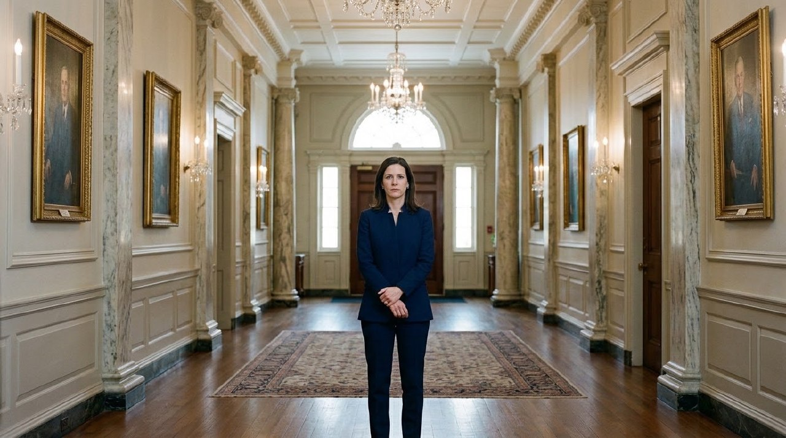
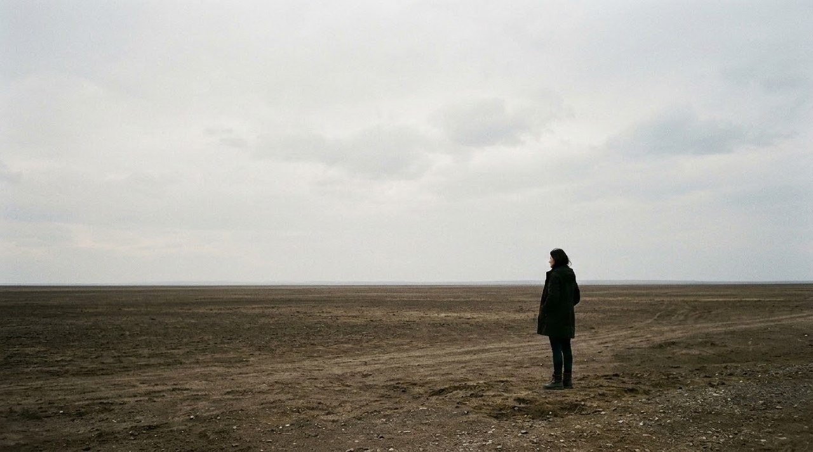
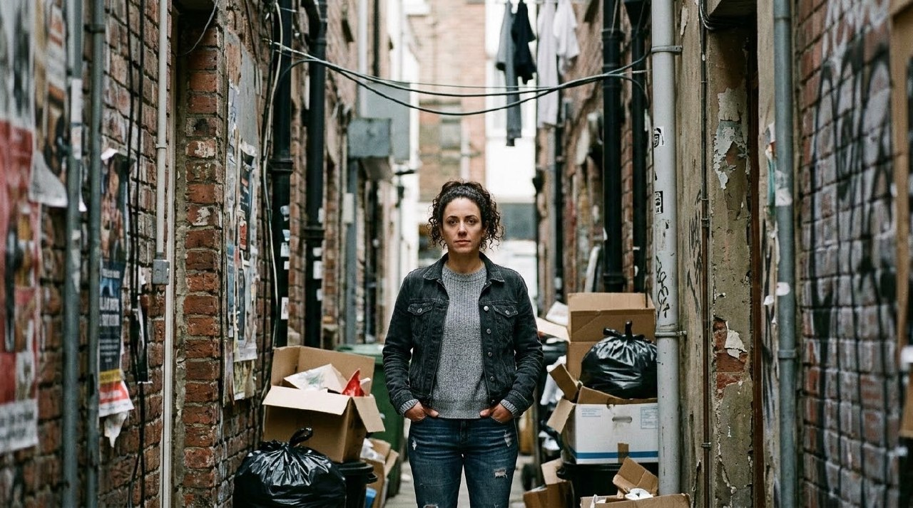

# Example — Composition Bible Psychological-Use Lookbook

## Purpose

Worked example of `knowledge/composition-bible.md` §"Psychological use" — the bible's direct claim that specific compositional techniques read as specific psychological effects: centering (authority, formality, confrontation), negative space (isolation, anticipation), compression (pressure, intimacy, surveillance), and wide depth (freedom, vulnerability, spatial awareness).

The same recurring subject was placed in four compositions, each engineering one technique explicitly (not just naming the mood), to test whether the technique itself — not incidental mood-word prompting — produces the claimed psychological read.

**Result: 4/4 compositions read as their claimed psychological effect**, and clearly differently from one another despite sharing a subject.

---

## 1. Centering → authority, formality, confrontation

**Prompt:** "...standing perfectly centered in a symmetrical formal hallway, facing directly toward camera with a still, direct, unflinching gaze. Perfectly centered composition, strict symmetrical balance on both sides of the frame, formal architectural framing."

QA: dead-center placement in a bilaterally symmetrical formal corridor, direct camera-facing gaze — reads as institutional authority and quiet confrontation, not a casual portrait. **Pass.**

## 2. Negative space → isolation, anticipation

**Prompt:** "...standing small in the lower third of the frame, surrounded by a vast empty flat plain under a pale overcast sky. Most of the frame is empty negative space above and around her, minimal visual detail elsewhere."

QA: the subject occupies a small fraction of the frame against an overwhelming, nearly featureless expanse — isolation is the immediate read, with the emptiness ahead of her suggesting anticipation of something not yet arrived. **Pass.**

## 3. Compression → pressure, intimacy, surveillance

**Prompt:** "...standing in a narrow, cluttered urban alley, shot with a compressed telephoto perspective that flattens the depth between her and the tight surrounding walls and objects. Claustrophobic, boxed-in framing with visual elements pressing in from both sides."

QA: walls, clutter, and hanging debris close in symmetrically from both sides with compressed depth, boxing the subject centrally — reads as watched/boxed-in rather than merely "a person in an alley." **Pass.**

## 4. Wide depth → freedom, vulnerability, spatial awareness

**Prompt:** "...standing small in a vast open wide-angle landscape, with clear foreground rocks, a midground of open fields, and distant background mountains, strong layered sense of depth and scale."

QA: distinct foreground/midground/background depth layers (per the bible's §Depth design — overlap, scale difference, atmospheric perspective all present) with the subject small against the mountains — reads as open freedom with an undertone of vulnerability against the landscape's scale. **Pass.**

---

## Takeaway

All four compositions produced their claimed psychological read using the *mechanics* the bible specifies (placement, scale, negative space, depth layering) rather than mood adjectives alone — and #2 (negative space) and #4 (wide depth) in particular, despite both being "small figure in a big empty environment," read distinctly differently (barren isolation vs. layered scenic depth) because the depth-design and negative-space mechanics were applied differently, confirming the bible's claim that these are separable, deliberate controls rather than one generic "small person, big background" trick.
