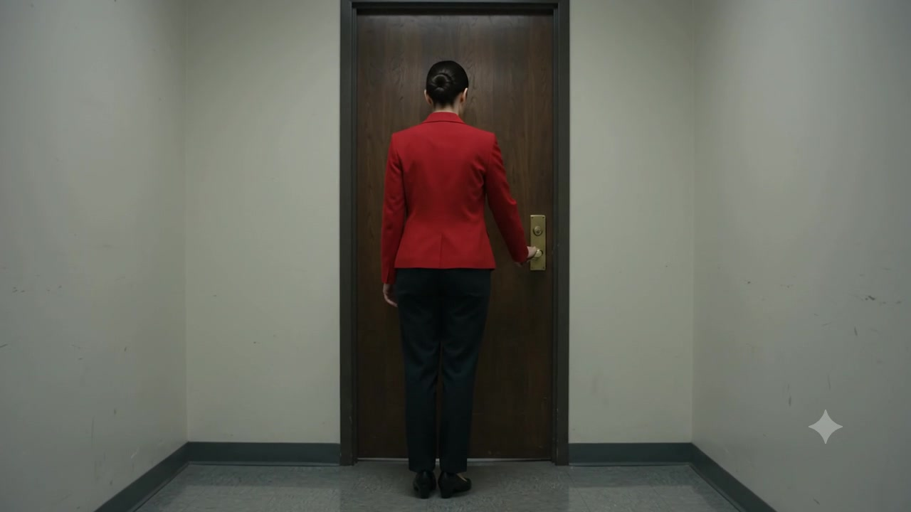
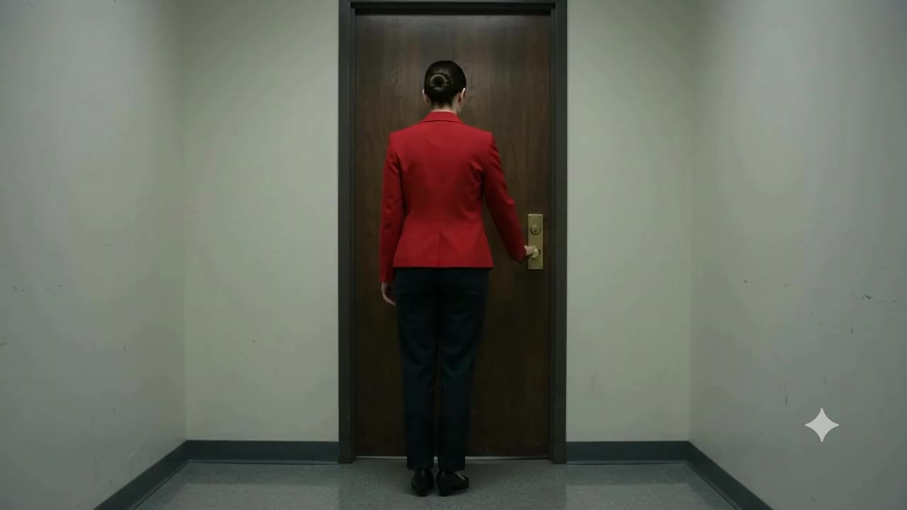

# Example — Continuity Bridge Video Lookbook

## Purpose

Worked example of `knowledge/continuity-bible.md`'s §Shot-to-shot rule — *"The end state of shot N must be a valid start state for shot N+1 unless a time/space discontinuity is explicit and motivated"* — and SKILL.md's §Shot state (`START STATE → ACTION → END STATE`).

This is the strictest possible test of that rule: rather than just writing a shot 2 prompt that *describes* a matching start state, shot 1's actual **last frame was extracted and used as shot 2's literal starting frame** (via the bot's `sfv`/start-frame-to-video mode). If continuity genuinely holds, shot 2 should continue the exact pose, wardrobe, and prop state shot 1 ended on — not just something plausibly similar.

---

## Shot 1 — establishing the end state

**Prompt (t2v):** "A woman in a red jacket walks down a plain hallway toward a wooden door, reaches out with her right hand, and grasps the door handle. She comes to a stop with her hand firmly on the handle, about to open it. Camera static, locked off."

<video src="assets/continuity-bridge-lookbook/01-shot1.mp4" controls width="480"></video>

**End state locked from shot 1's last frame:**

Character: red jacket, dark trousers, hair in a bun, back to camera. Prop: right hand gripping the door handle. Spatial: centered in frame, facing the door.

## Shot 2 — continuing from that exact frame

**Prompt (sfv, using the frame above as the literal start frame):** "She turns the handle, pushes the door open, and steps through into the room beyond, continuing forward through the doorway. Same wardrobe, same character, natural continuous motion from this exact starting pose."

<video src="assets/continuity-bridge-lookbook/02-shot2.mp4" controls width="480"></video>

**Shot 2's actual first frame**, for direct comparison against shot 1's end frame above:

---

## QA

- **Pose/identity/wardrobe continuity:** shot 2's first frame is essentially identical to shot 1's end frame (same pose, same red jacket, same hair, same hand-on-handle position) — expected, since `sfv` mode starts from that literal image, but it confirms the mechanism actually anchors to the specified frame rather than drifting.
- **Action continuity:** the door opens, she steps through into a new hallway beyond, and walks on with a natural continuous gait — the action picks up exactly where shot 1 left off rather than restarting or skipping the door-opening beat.
- **Wardrobe/prop persistence across the cut:** red jacket, dark trousers, and hair stay consistent through the new hallway; the door remains visibly open behind her later in the shot, matching physical object-state persistence (`continuity-bible.md` §Prop: lifecycle state).
- **Observed anomaly (unrelated to the core continuity test):** later in shot 2, a small stray hand-like shape is visible near the open door frame's edge in the background — a minor object/limb-mutation artifact per `knowledge/ai-video-failure-bible.md`, not connected to the main subject's continuity, which held correctly. Noted honestly rather than cropped out of the write-up.

**Verdict:** the core continuity-bridge claim — end state of shot N is a valid, actually-used start state for shot N+1 — held. **Pass**, with one unrelated background artifact flagged.

---

## Takeaway

Frame-anchored continuity (extract the real last frame, start the next shot from it) is a stronger continuity test than prompt-described continuity, because it removes "did the model happen to imagine something similar" as a variable — shot 2 has no choice but to begin from the exact pixels shot 1 ended on. The one artifact that did appear was unrelated to the tested claim (a background limb-mutation glitch, not a continuity break), which is exactly why `knowledge/continuity-bible.md`'s §Validation rule says to validate identity, object state, geography, and narrative knowledge *separately* rather than judging a shot as one pass/fail blob.
