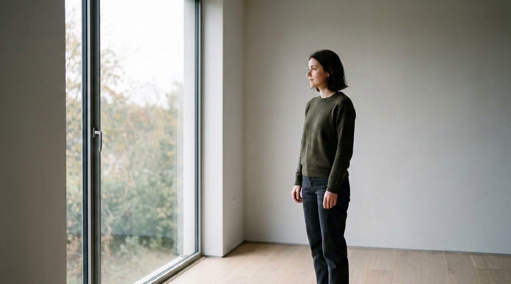
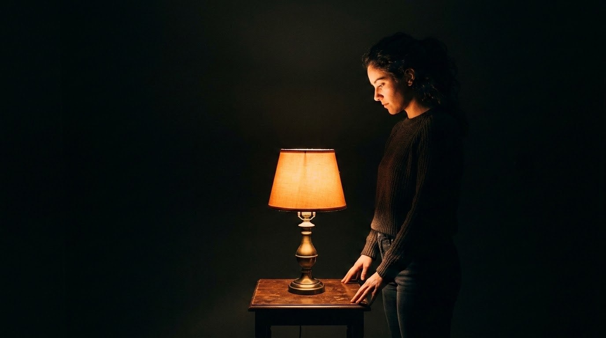
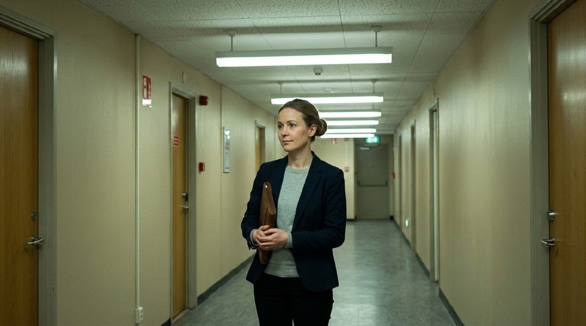
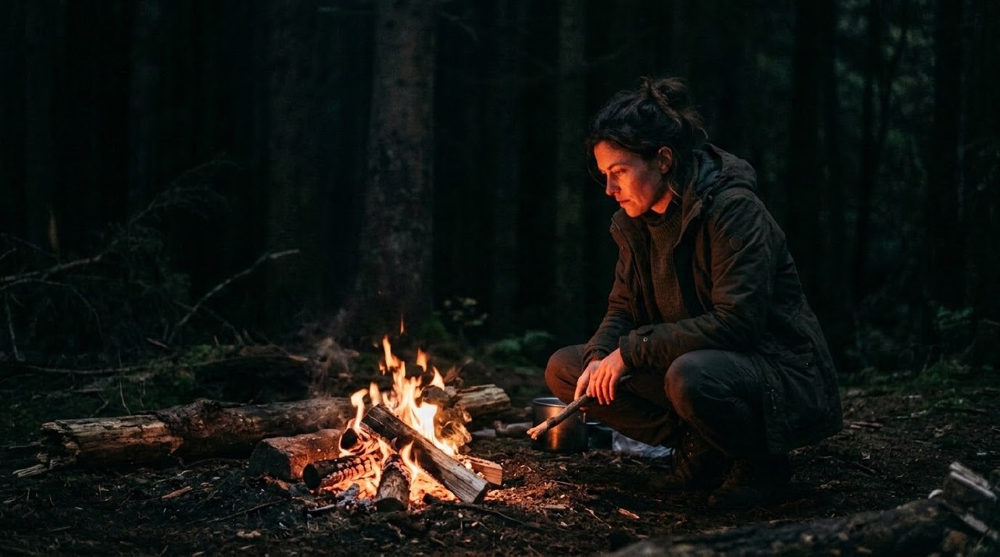
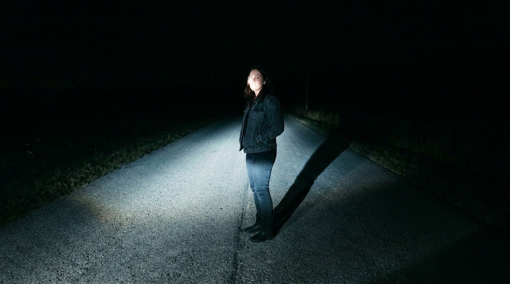
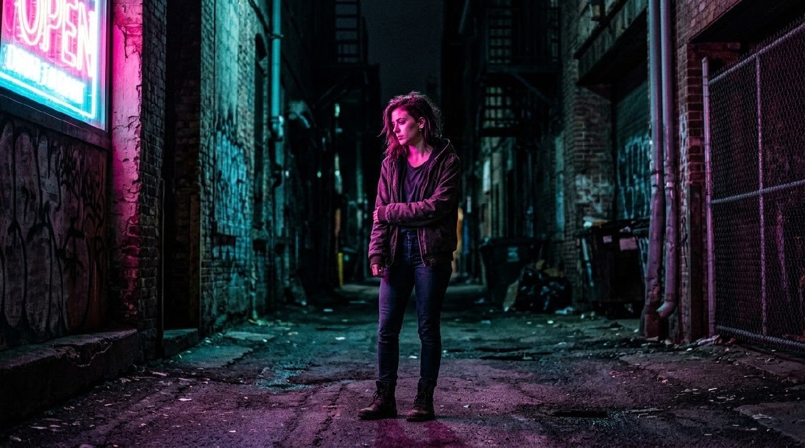

# Example — Lighting Bible Source Lookbook

## Purpose

Worked example of `knowledge/lighting-bible.md`: define light through source, motivation, direction, size, hardness, intensity, falloff, color temperature, and contrast — and avoid "cinematic lighting" as an instruction with no defined source behavior.

Six of the bible's listed §Sources were each isolated as the *only* light source on the same recurring subject, with every parameter from §"Define light through" stated explicitly in the prompt (never just "cinematic lighting"). If the checklist genuinely constrains the render, each source should produce a visually distinct, physically characteristic result — not a generic moody-photo look repeated six times with a different backdrop.

**Result: 6/6 sources produced visually distinct lighting behavior consistent with their real-world physical character**, confirming that stating the full parameter set (not just naming the source) is what makes the difference.

---

## 1. Window (motivated_window)

**Prompt:** "...standing near a large window in a plain minimalist room at midday. Lighting: single large soft window key light from camera-left, no fill light (negative fill on the shadow side of her face), soft gentle falloff, neutral-cool daylight color temperature, low-moderate contrast. No other light sources, no practicals, no artificial light."

QA: soft directional falloff across the face with a gently darker shadow side (no fill, as specified), cool-neutral daylight color — a real large-soft-source signature, not a flat ambient look. **Pass.**

## 2. Practical lamp (tungsten)

**Prompt:** "...standing beside a warm tungsten table lamp in a plain dark room at night. Lighting: single warm practical lamp as key light, no fill, hard fast falloff so light drops off quickly away from the lamp into darkness, warm orange-tungsten color temperature, high contrast with deep shadows beyond the lamp's reach."

QA: light intensity visibly collapses to near-black just past the lamp's radius (fast falloff as specified, unlike the window's gentle falloff) — a correctly distinct falloff signature from source #1. **Pass.**

## 3. Fluorescent

**Prompt:** "...standing in a plain office hallway lit only by overhead fluorescent tube lighting. Lighting: fluorescent panel light from directly above as the only source, broad even coverage acting almost like its own fill, cool greenish-white color temperature, low contrast, minimal shadow falloff, flat even illumination."

QA: flat, even, minimal-shadow illumination with a slightly cool/green cast — the "broad source acting as its own fill" behavior specified, correctly the flattest of all six. **Pass.**

## 4. Fire

**Prompt:** "...crouched beside a campfire at night in a dark forest clearing. Lighting: fire as the only key light source, warm orange color temperature, hard directional light coming from low and to the side, strong falloff into darkness just beyond the fire's reach, deep contrast, no other light sources, no moonlight."

QA: light correctly comes from *below* her eyeline (fire is on the ground, unlike lamp/window which are near head height), warm and directional with the forest falling to near-total darkness just past the fire's throw. **Pass.**

## 5. Vehicle headlights

**Prompt:** "...standing on a dark empty road at night, illuminated only by a car's headlights from off-camera. Lighting: hard direct headlight beam as the only key light, low camera-left angle, cool-white color temperature, strong directional cast shadow behind her, high contrast, dark background beyond the beam's reach, no streetlights, no moonlight."

QA: hard cool-white beam with a long, sharp cast shadow thrown behind her — the single most distinctive signature of the six (a true hard point/beam source), and correctly differentiated from the fire's soft-edged warm glow despite both being "single hard-ish source at night." **Pass.**

## 6. Signage (neon)

**Prompt:** "...standing in a dark alley at night lit only by a colored neon sign off-camera. Lighting: magenta-and-cyan neon signage as the only key light, medium-hard source, moderate falloff, visible color contamination on her skin and the surrounding surfaces, high contrast, dark surroundings beyond the sign's glow, no streetlights, no moonlight."

QA: visible magenta/cyan color contamination across skin and brick walls (the specified "color contamination" behavior, not a neutral-white light with colored objects in frame) — the only source of the six with a non-neutral color cast on the subject itself, correctly so. **Pass.**

---

## Takeaway

Each source produced a different falloff rate, direction, hardness, and color signature — window (gentle falloff, cool-neutral, soft), lamp (fast falloff, warm, small), fluorescent (near-zero falloff, cool-green, flat), fire (low-angle, warm, hard-edged), headlights (beam-hard, cool, long cast shadow), neon (color-contaminating, medium-hard). None of the six defaulted to a generic "moody lighting" look, which is exactly what the bible's warning against undefined "cinematic lighting" is meant to prevent.
