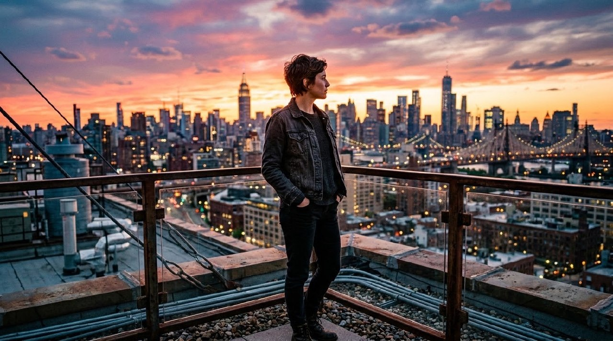
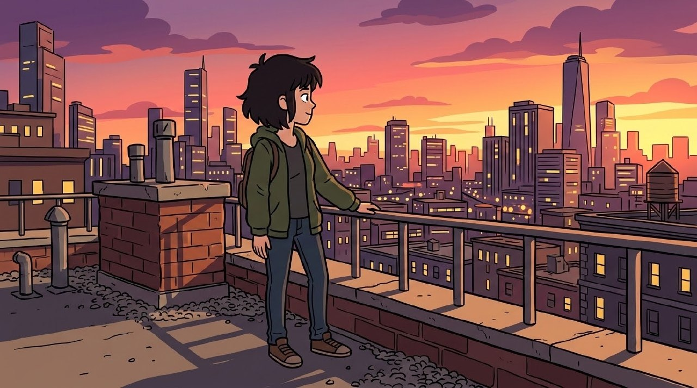
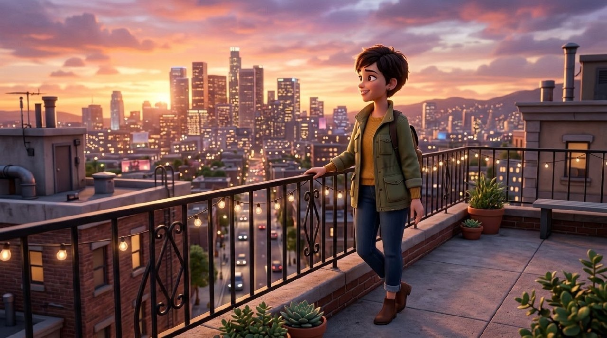
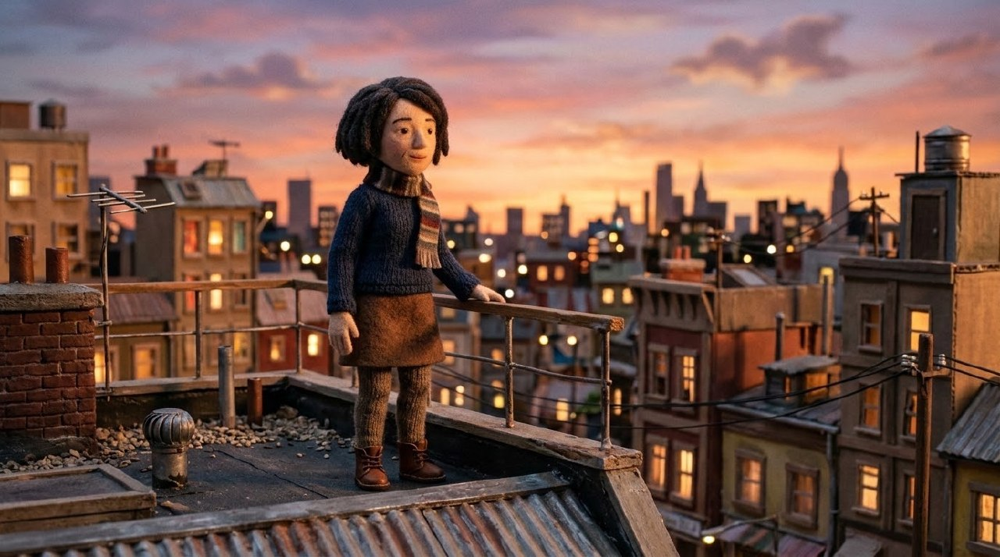
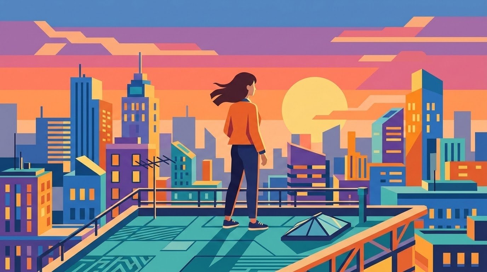

# Example — Realism Level Axis Lookbook

## Purpose

Worked example of `knowledge/video-taxonomy.md` §1's **Realism level** classification axis — one of the 8 axes a brief must be classified along before design begins (Purpose × Format × Genre × Platform × Duration × Audience × Realism level × Production mode). Realism level typical values: `photoreal live-action, stylized live-action, animation (2D/3D/stop-motion), motion graphics, hybrid`.

This is where a request like "make it a cartoon" resolves in the taxonomy: it's a Realism-level classification (→ `animation (2D)`), not a separate style system layered on top. Getting this axis right early matters because it changes which family (§2) and inflection notes (§3) apply — critically, per the Animation/Motion row: *"Physical realism constraints in `performance-bible.md`/`ai-video-failure-bible.md` relax or don't apply — style-consistency replaces photoreal-plausibility as the QC concern."*

Same character concept and scene (a woman on a city rooftop at sunset, looking at the skyline) rendered across six Realism-level values, to demonstrate the axis produces a materially different visual direction rather than a cosmetic filter — and to confirm none of the non-photoreal renders accidentally regressed toward photoreal (or vice versa).

---

## 1. Photoreal live-action

**Prompt:** "Photoreal cinematic still: a woman in her early 30s, short dark hair, casual jacket, standing on a city rooftop at sunset, looking out at the skyline. Naturalistic photographic rendering, real-world lighting and skin, physically accurate proportions, believable materials and texture. No camera or recording equipment visible in frame, no HUD, no watermark, no logos or text."

QA: reads as an unstaged real photograph; skin, fabric, and architectural materials behave naturalistically. **Pass.**

## 2. Stylized live-action

**Prompt:** "Stylized live-action still: a woman ... same rooftop sunset scene. Heightened cinematic color grade, dramatic controlled lighting, boosted contrast and saturation, grounded in a real photographic look, not painted or illustrated. No camera or recording equipment visible in frame, no watermark, no logos or text."

QA: still photographic in nature (real materials, real light behavior) but with a heightened, more dramatic grade than #1 — the intended middle ground between photoreal and animation. **Pass.**

## 3. Animation — 2D

**Prompt:** "2D animated illustration: a stylized cartoon character of a woman, short dark hair, casual jacket, standing on a city rooftop at sunset, looking out at the skyline. Clean flat-shaded 2D animation style, bold linework, simplified proportions, consistent character design suitable for an animated series. No photorealistic rendering, no watermark, no logos or text."

QA: flat shading, bold outlines, simplified proportions — per the Animation/Motion inflection note, judged on style-consistency (does it look like one coherent show's character design), not photoreal plausibility. **Pass.**

## 4. Animation — 3D

**Prompt:** "3D animated render: a stylized 3D character of a woman, short dark hair, casual jacket, standing on a city rooftop at sunset, looking out at the skyline. Modern stylized animated-feature character design, smooth appealing shading, simplified expressive proportions, consistent character model, non-photorealistic skin texture. No watermark, no logos or text."

QA: dimensional but clearly a stylized 3D character model (skin/shading reads as animated-feature style, not photoreal render); distinct from both #1/#2 and from #3's flat 2D treatment. **Pass.**

## 5. Animation — stop-motion

**Prompt:** "Stop-motion animation still: a handcrafted stop-motion puppet character of a woman, short dark hair, textured fabric clothing, standing on a miniature model city rooftop set at sunset, looking out at a miniature skyline. Visible clay/felt puppet texture, practical miniature set lighting, tangible handmade materials, slight charming imperfection characteristic of stop-motion craft. No watermark, no logos or text."

QA: visible handcrafted puppet/felt texture and a miniature-set quality to the environment, distinct from both photoreal and the two other animation treatments. **Pass.**

## 6. Motion graphics

**Prompt:** "Motion graphics style still: a flat vector-illustrated figure representing a woman standing on an abstract geometric city rooftop skyline at sunset. Bold flat color shapes, minimal geometric shading, clean vector illustration style typical of explainer/motion-graphics videos, no photorealistic or painterly rendering, no watermark, no logos or text."

QA: fully abstracted into flat vector shapes with no character facial detail — correctly the most stylized end of the spectrum, appropriate to explainer/motion-graphics work rather than character-driven narrative. **Pass.**

---

## Takeaway

All six renders are unmistakably distinct from one another despite sharing the same subject, pose, and scene — confirming the axis is a real creative-direction fork, not a cosmetic label. This is also the practical reason `video-taxonomy.md` insists routing happens *before* CREATIVE PROBLEM: getting Realism level wrong here would misapply photoreal continuity/physical-plausibility rules (`prevention-first-generation.md`, `ai-video-failure-bible.md`) to a family (Animation/Motion) whose actual QC concern is style-consistency instead.
