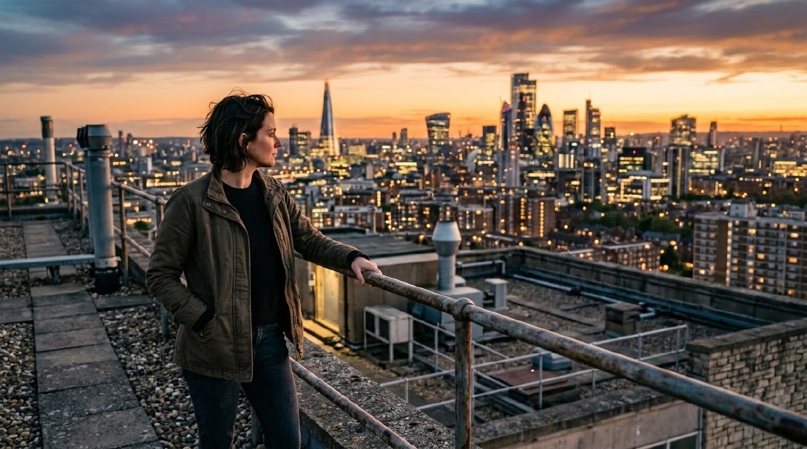
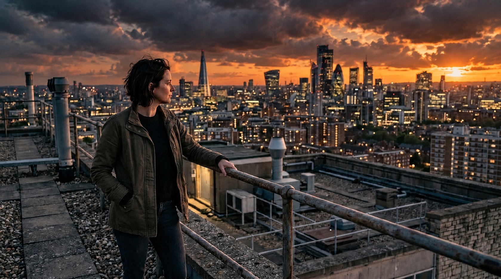
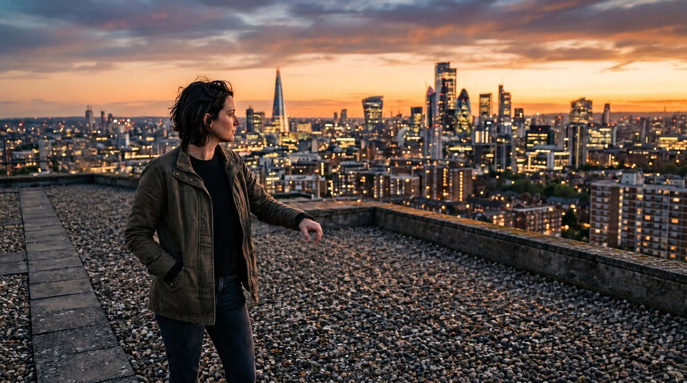
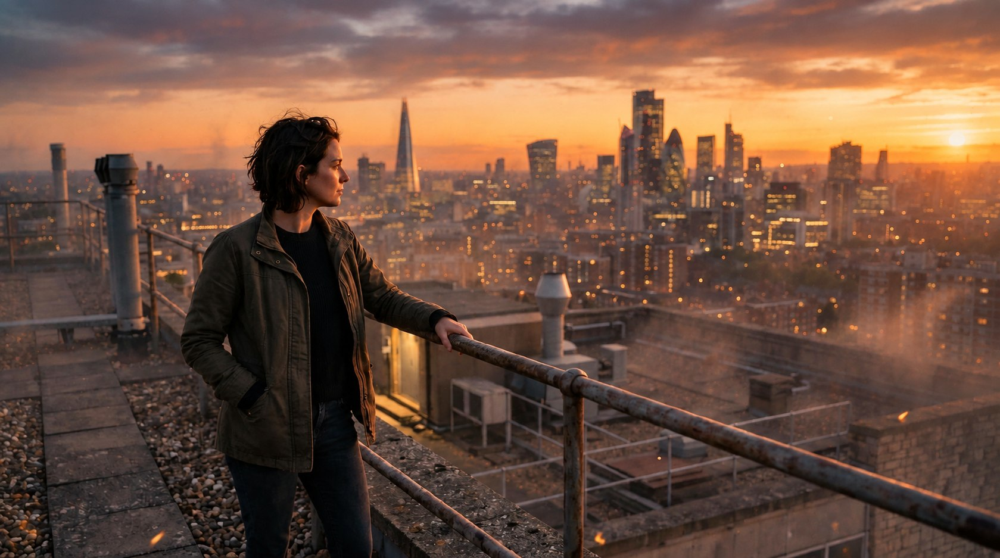

# Example — VFX / Compositing Lookbook

## Purpose

Worked example of `knowledge/post-production-bible.md` §"VFX / cleanup / compositing" and `knowledge/color-grading-bible.md` §28 (*VFX/CG integration*). There is no standalone "VFX bible" file in this skill — VFX is a post-production stage in the pipeline (`ASSEMBLY → EDIT → PICTURE LOCK → VFX/CLEANUP/COMPOSITING → COLOR → ...`), and its integration checklist (match perspective, light, shadow, focus, motion blur, grain/texture, and color pipeline) lives across those two files.

Three of the bible's listed VFX operations were tested as real reference-image edits (using the bot's GPT Image 2.5 edit mode, `reference_image` + edit instruction) against a single photoreal plate — [`realism-level-lookbook.md`](realism-level-lookbook.md)'s frame 1 (a woman on a city rooftop at sunset):

1. **Sky replacement**
2. **Object removal**
3. **Generated-element integration** (particles/atmosphere)

Each result is judged against the bible's own integration checklist, not just "does it look nice."

### Original plate

---

## 1. Sky replacement

**Edit instruction:** "Replace only the sky in this image with a dramatic stormy sunset sky with heavy clouds and warm rim light. Match the same light direction and color temperature as the existing rooftop scene and subject so the composite is seamless and physically consistent. Keep the woman, her lighting, the rooftop, railing, and buildings exactly as they are — only the sky changes."

QA against the integration checklist:
- **Light direction:** the new sky's sun position (low, right side) still agrees with the subject's existing warm rim-light on her hair and the right-lit building faces — no direction mismatch, the single most common sky-replacement failure.
- **Color temperature:** warm sunset tone carried through consistently onto foreground elements, not just the sky itself.
- **Perspective/geometry:** cloud scale and horizon line remain plausible for the same rooftop vantage point.
- Minor note: background city-light saturation shifted slightly warmer/richer alongside the sky change — a small unrequested grade drift worth flagging in a real pass, not a directional-lighting failure.

**Verdict: Pass**, with a minor color-consistency note.

---

## 2. Object removal

**Edit instruction:** "Remove the metal railing and rooftop vents/pipes from the foreground of this image. Fill in the rooftop surface naturally and consistently with the existing lighting, shadows, and perspective. Keep the woman, her pose, the skyline, and the sky exactly as they are."

QA against the integration checklist:
- **Clean plate quality:** railing and foreground pipe removed with no visible seam; gravel/rooftop texture continues naturally where the railing used to be.
- **Perspective:** the parapet ledge and roofline read as geometrically consistent with the original vantage point.
- **Unrequested but correct adaptation:** her hand, which was resting on the now-removed railing, was naturally repositioned instead of being left floating in space or clipping through geometry that no longer exists — the kind of physical-plausibility consequence the prevention-first rules care about, handled correctly here without being asked.

**Verdict: Pass.**

---

## 3. Generated-element integration (atmosphere/particles)

**Edit instruction:** "Add a subtle layer of atmospheric haze and a few drifting embers/smoke particles across this rooftop scene, lit by the same warm sunset light direction as the existing scene, with correct perspective and depth falloff (particles further away appear smaller and softer). Keep the woman, the skyline, and the sky exactly as they are."

QA against the integration checklist:
- **Light color on the added elements:** embers and haze pick up the same warm sunset color as the rest of the scene rather than reading as a neutral-gray overlay.
- **Depth falloff:** haze density increases with distance toward the skyline (atmospheric perspective), and embers nearer camera read slightly larger/sharper than ones further back — matches the requested depth behavior.
- **Non-destructive to the plate:** subject, skyline, and sky remained unchanged as instructed; only the requested atmospheric layer was added.

**Verdict: Pass.**

---

## Takeaway

All three composites integrated correctly on the checklist's actual criteria (light direction/color, perspective, depth) rather than merely "looking plausible" — including one unrequested but physically-correct adaptation (the hand repositioning after railing removal) that a naive edit could easily have gotten wrong. Per the bible's own warning, none of these were used to conceal a fundamentally broken generation; they were compositing operations layered onto an already-correct plate, which is the intended use.
